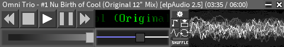
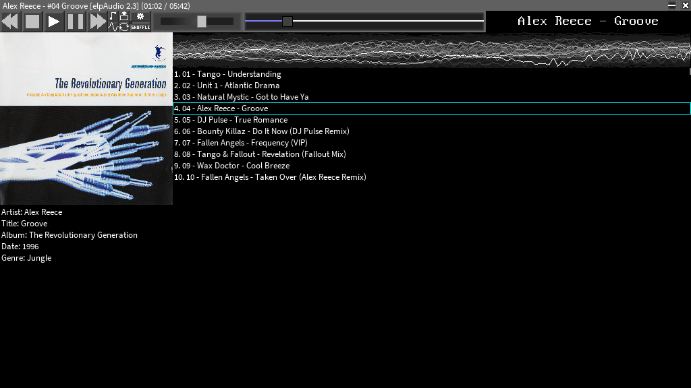

# elpAudio 

 ### elpAudio - simple audio player using FMOD, made on Game Maker 8.2. Has more liberty than WinAmp.
**elpAudio has a discord server - you can <a href="https://discord.gg/n64mcGT6Sr">click here</a> to join it!**
## FEATURES
elpAudio supports popular music file formats (`.mp3, .wav, .ogg, .flac, .opus`), tracker music (`.mod, .xm, .s3m, .it`) and other formats (`.m3u, .m3u8, .pls, .fsb, .mp2, .wma`). 
elpAudio has it's own playlist format called elpAudio PlayList (`.epl`), it's so simple to edit and save!
And, most important, **elpAudio supports custom themes (skins), visualisers and plugins!** and even support Winamp2 skin files (`.wsz` or `.zip`), they will be converted to elpAudio theme with `wsz2eat` that is available in elpAudio settings 

For the moment elpAudio supports only Windows systems and can run even on Windows XP! 

**elpAudio on Linux WINE works well. Here is a screenshot to prove it!** (Used Fedora Workstation 40 with MATE desktop)

## Do you have a bug? Or you just want to help the project, ask a question or give an idea? 
Send your message to telegram: **@cactusquid**, or on e-mail: **elpoepstudios@gmail.com**, **elpaudiodev@gmail.com**

****For older releases, please consider to <a href='https://github.com/elpoeprod/elpAudio/releases'>this link.</a>****

# HOW TO USE:
-go to releases, download latest version of elpAudio and open the elpAudio.exe. Enjoy the "new **WinAmp**"!

## To compile source code of elpAudio you need:
  - Game Maker 8.2

### How to install Game Maker 8.2?
<a href="https://www.mediafire.com/file/bqwyde1k1s2hrz2/Game_Maker_8.2_Setup.exe/file">Click here to download installer</a>, then install it on your PC.
Then download all of the files in the repository and click on "elpAudio.gm82". Done! Now you can do anything.
## Sorry, but more than half of the source code is uncommented for one purpose: executable size.

